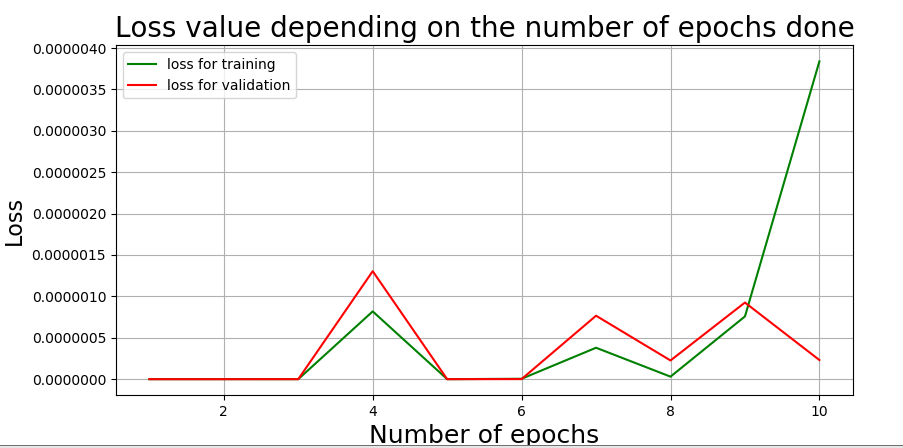
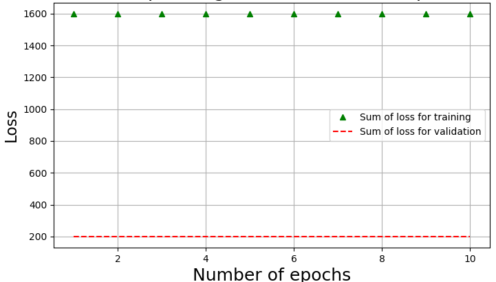

# Report

## General notes: problems encountered and resolution/interpretation.
Our main problem was that when we run our `project.py` file with the constant function (file that used to contain the training **and** the testing of the network), we did not obtain the same result each time.  
In order to solve this problem, we split the file in two separate files, one for testing and one for training. In the training file, we modified the training so that the network trains on several epochs (which was not the case before). We also add the saving if the trained network after each epoch.  
Nevertheless, the loss values sometimes were not decreasing.  

Consequently, we add a condition for the saving of our model: it is saved only if the loss value is lower than that obtained after the precedent epoch. It also enables us to see the evolution of the loss value.  

In the testing file, we load the trained network we trained and saved in the training file and we plot the results (comparison between the function an the approximation by the network and the error between those two functions).

However, we still sometimes get a network incapable to learn.  
  
When it happens, the loss values are always the same: 1600 for the sum of loss for the training, 200 for the sum of loss for the validation (when the |train_set| = 1 600 et |validation_set| = 200). Our interpretation is that it depends on the initialization of the network's weights. Maybe those weights are way too far from the weights we are aiming and thus it yields to a sort of breaking point for the network that gives "default values"/maximum error value ? Perhaps because it gives the maximum error possible the network doesn't know how to update the weights and thus does nothing.

## Tests: graphs and analysis
### Tests on `data_constant_2000.pkl`
**How can we interpret the shape of the error function?**
* W = 5, L = 2, N = 2000, **NB_EPOCH = 1**, learning_rate = 0.0001  

* W = 5, L = 2, N = 2000, **NB_EPOCH = 5**, learning_rate = 0.0001  

After 5 epochs, the sum of loss value of the training is roughly of 0.242.
  
I don't know why the function has this shape... 

* W = 5, L = 2, N = 2000, **NB_EPOCH = 10**, learning_rate = 0.0001  

After 10 epochs, the sum of loss value of the training is between 5.50e-3 and 5.25e-3.  

* W = 5, L = 2, N = 2000, **NB_EPOCH = 50**, learning_rate = 0.0001  

After 50 epochs, the sum of loss value of the training is lower than 1e-5 and that of the validation is lower than 1e-8.

Gives the right value (they are all really close to 1), but does it give the right f(x) ?

* W = 5, L = 2, N = 2000, **NB_EPOCH = 100**, learning_rate = 0.0001 

After 8 epochs, the sum of loss value of the validation is already below 0.5.
After 5 epochs, the sum of loss value of the training is below 10.
After 20 epochs, the sum of loss value of the validation is below 0.01 and that of the training is below 0.1.
After 24 epochs, the sum of loss value of the validation is below 1e-5 and that of the training is below 5e-4.

